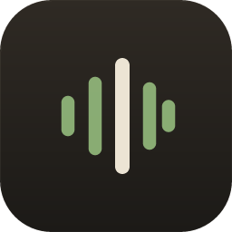
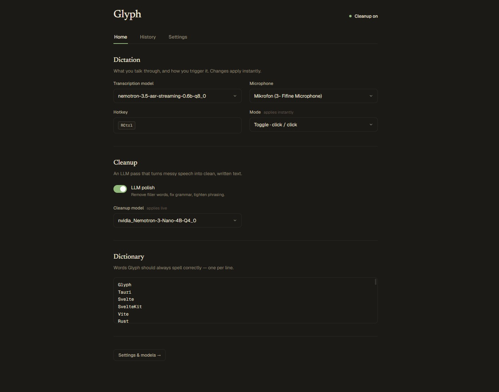
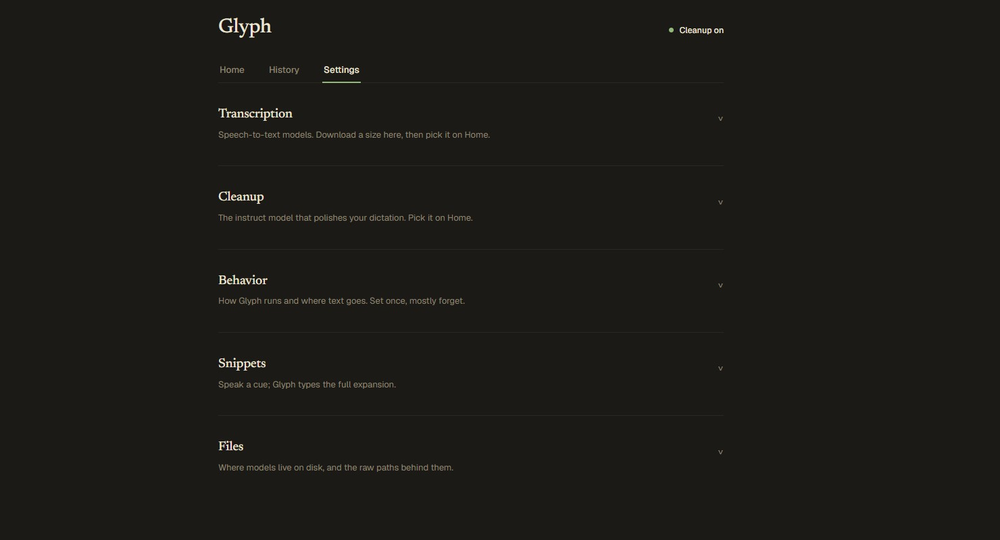

<div align="center">
  
  <h1>Glyph</h1>
  <p><strong>Talk, and it types.</strong><br/>A private, on-device voice keyboard for Windows.</p>
</div>

---

Glyph lets you dictate into **any** app — your editor, your browser, chat, email, anything with a text cursor. Hold a hotkey, say what you mean, let go, and your words appear as text right where you're typing. Everything runs **locally on your machine**: your voice never leaves your computer, there's no account, and there's no subscription.

Think of it as a **free, local, open-source alternative to [Wispr Flow](https://wisprflow.ai)** — the same idea (hold a key, talk, get clean text in any app), but everything runs on your own machine, with no account, no subscription, and no usage limits.

## Why Glyph?

- **Free and open-source** — no account, no subscription, no usage limits.
- **Private by default** — speech recognition and text cleanup run entirely on your PC. Nothing is uploaded, ever.
- **Works everywhere** — types into whatever app is focused (clipboard paste or simulated keystrokes). No per-app plugins.
- **Optional AI cleanup** — a small local LLM strips the "um"s, fixes grammar and punctuation, and tightens phrasing. Or turn it off for a raw transcript.
- **Your models, your hardware** — choose Whisper (small to large) or NVIDIA Nemotron, run on GPU (Vulkan/CUDA) or CPU, and download models right inside the app.
- **Dictionary & snippets** — teach Glyph your proper nouns so it always spells them right, and expand spoken cues into full phrases.
- **Quiet and out of the way** — lives in the system tray as a tiny status orb that never steals focus from your games or fullscreen apps.

## Screenshots

<div align="center">
  
  <br/>
  <sub><em>Home — your everyday controls: model, mic, hotkey, cleanup toggle + model, and dictionary.</em></sub>
  <br/><br/>
  
  <br/>
  <sub><em>Settings — calm, collapsible sections: Transcription, Cleanup, Behavior, Snippets, Files.</em></sub>
</div>

## How it works

Glyph is a [Tauri](https://tauri.app) desktop app (Rust + Svelte) wrapped around a small dictation engine:

1. A **global hotkey** starts/stops recording — hold-to-talk or click-to-toggle.
2. Audio is captured and streamed to a local **ASR engine**: a Whisper sidecar, or the Nemotron / parakeet streaming runtime.
3. *(Optional)* the raw transcript is passed through a local **llama.cpp** server running a small instruct model that rewrites it into clean written text, guided by your personal dictionary.
4. The result is **injected at your cursor** — clipboard paste or per-character Unicode typing.

Models and runtimes are managed for you and download from inside the app (**Settings → Transcription / Cleanup**).

## Requirements

- Windows 10/11 (x64)
- A microphone
- Disk space for the models you download (~0.5–4 GB each). A GPU (Vulkan or CUDA) is recommended, but CPU works.

## Download

Grab the latest **Windows installer** from the [Releases](https://github.com/StanTheGorilla/Glyph/releases/latest) page:

- **`Glyph_<version>_x64-setup.exe`** — recommended (NSIS installer)
- `Glyph_<version>_x64_en-US.msi` — MSI alternative

Run it, launch Glyph, then open **Settings** and download a transcription model (and a cleanup model, if you want polish) to get going.

## Build from source

You'll need [Rust](https://rustup.rs), [Node.js](https://nodejs.org), and the [Tauri prerequisites](https://tauri.app/start/prerequisites/) for Windows.

```bash
git clone https://github.com/StanTheGorilla/Glyph
cd Glyph/glyph-app
npm install

# Development (hot reload):
npm run tauri dev

# Release build — produces src-tauri/target/release/glyph-app.exe:
npm run tauri build -- --no-bundle
```

## Using Glyph

1. Launch Glyph — it sits in your system tray with a status orb.
2. On first run, open **Settings** and download a **transcription model** (and a **cleanup model** too, if you want polished output).
3. On **Home**, pick your model and microphone, and set your hotkey and mode.
4. Hold your hotkey, speak, and release — your text lands in the focused app.

The status orb tells you what's happening: **grey** = idle · **red** = listening · **orange** = transcribing.

## Privacy

Glyph is local-first. Your audio, transcripts, and history stay on your device. The optional cleanup step is a local llama.cpp server — no audio or text is sent over the network for transcription or cleanup.

## Tiling window managers

The status orb is a click-through tool window with app-window styles stripped, so most tiling managers leave it alone. If yours still grabs it, add a float/ignore rule for the window titled **`Glyph HUD`**. For [komorebi](https://github.com/LGUG2Z/komorebi), a title rule keeps it out of the layout, e.g.:

```
komorebic float-rule title "Glyph HUD"
```

## Tech stack

Tauri 2 · Svelte 5 · Rust · whisper.cpp · Nemotron / parakeet · llama.cpp

## License

[MIT](LICENSE) © StanTheGorilla
